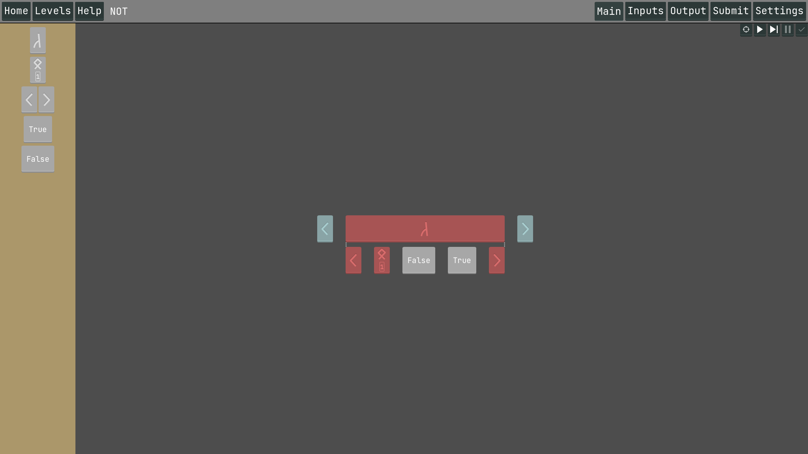

# Knights of the Lambda Calculus
Knights of the Lambda Calculus (KOTLC) is an offline, free-to-play, puzzle game built for Windows and Linux on x86-64 and arm64 systems. We have also released a Web build hosted on itch.io, but it has not been tested thoroughly as we focused development on the desktop app.
It was developed using the [Godot](https://godotengine.org/) game engine over the span of 2 months as part of a university project.

The goal of this game is to teach players how Lambda Calculus works, by guiding players to construct expressions that express computations within the Lambda Calculus. At the end of the game, we hope that players can get a sense of how such a simple system can be powerful enough to compute anything a normal computer can.

The target audience of our game is anyone who is interested in Lambda Calculus, be it a beginner who has no experience programming, or a seasoned programmer who is curious about this topic, or even someone deeply familiar with Lambda Calculus but want to explore it more in a visual and interactive manner.

You may read the full report [here](https://docs.google.com/document/d/1K2c2m2xiXbEPLF_2184v8KYaje0Euo6lEHTNB5Bs1xk/edit?usp=sharing)

## Installation

Download builds from the releases page. The Web build is also being hosted [here](https://mug1wara26.itch.io/knights-of-the-lambda-calculus)

## Bug reports or feature requests
Feel free to make a GitHub issue on this repository to report any bugs or request for any new features.

## Game screenshots
Note that these screenshots may contain spoilers to solutions

*The interface for solving a level. The solution to the level NOT is shown here*

*A Lambda expression being animated, this Lambda expression is also known as the omega operator*

## Acknowledgements
Developed by me and [@notmeegoreng](https://github.com/notmeegoreng)
